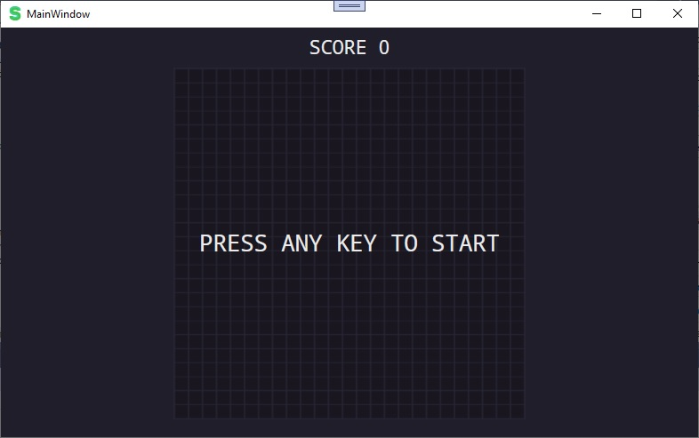
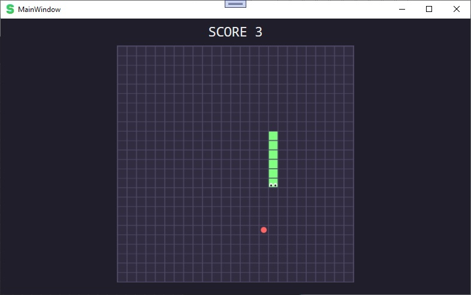

# Snake
  **Snake** is a small desktop application that allows users to play the classic Snake game. The goal is to guide the snake to eat the food displayed on the screen while avoiding collisions with the walls or its own body. The application is developed using C# and the .NET Framework, providing an intuitive graphical interface
  
  ## Usage Instructions
   - **Start the Game**: The application opens with a game grid and an initialized snake in the center of the grid. Press any key to start the game.

   - **Control the Snake**: Use the arrow keys (Up, Down, Left, Right) to control the snake's direction.

   - **Game Objective**: Guide the snake to eat the food that appears randomly on the grid. Each time the snake eats the food, it will grow in length and the score will increase.

   - **End of the Game**: The game ends when the snake hits the walls or its own body. After the game ends, a "Game Over" message will be displayed, and you can press any key to start a new game.

### Technologies and Tools Used
   - **C#**: The programming language used for developing the application.
     
   - **.NET Framework**: The development platform for creating desktop applications.
     
   - **System.Windows**: The GUI library used for building the user interface.
     
   - **System.Threading.Tasks**: The namespace used for working with asynchronous tasks.
   
   - **Code Analyzers**: Microsoft.CodeAnalysis.NetAnalyzers, Roslynator.Analyzers, SonarAnalyzer.CSharp for code analysis and quality improvement.

#### Screenshots
 -

 -

 - For more screenshots, please visit [Screenshots](Screenshots)

